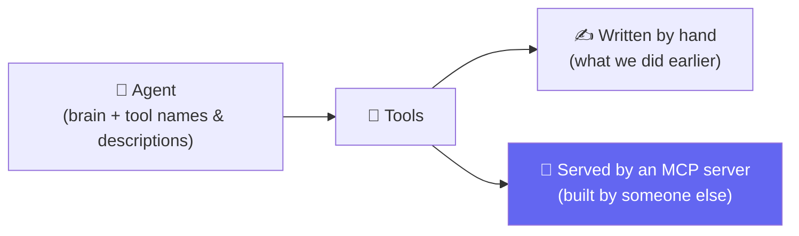
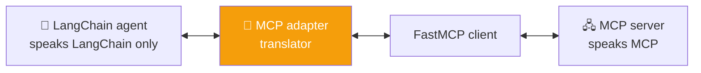
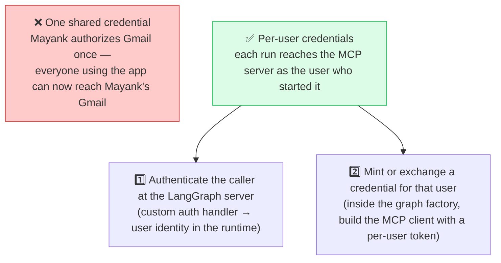
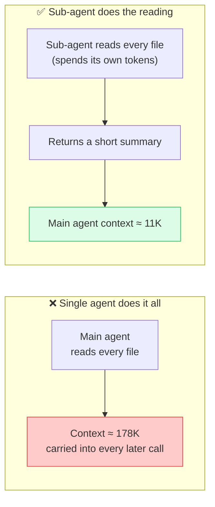
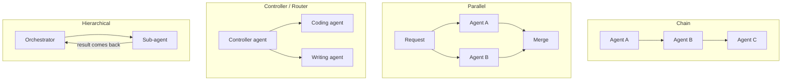
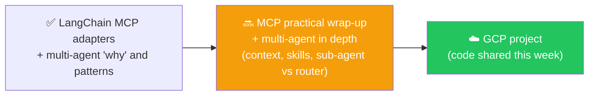

# 🔗 Class 23: LangChain MCP Adapters & Why Multi-Agent Architecture Exists
### 📋 Agentic AI 3.0 Specialization | Krish Naik Academy

**🎙️ Mentor:** Mayank Aggarwal
**⏱️ Duration:** ~3 hours | **📅 Session:** Day 23 (27 September 2026)

---

## 📰 Quick Updates
- 🔙 **Back to LangChain.** The MCP detour is over: it ran long on purpose, so MCP would be understood in real depth, and the course now returns to agents in LangChain. Two topics are on the table: **LangChain's MCP support** and **multi-agent systems**.
- ☁️ **Next weekend is a LangChain project on GCP.** Learners were asked to create a Google Cloud free-trial account (about $300 in credit) beforehand. AWS and Azure come later; Mayank was clear he would cover all three in projects and didn't want to referee a cloud-vendor debate.
- 📓 A live demo of the LangChain MCP integration hit a version problem partway through (LangChain's MCP package is in beta and needed a newer LangChain release than the notebook environment had). The concepts were taught fully; the working notebook was promised for later, along with a practical MCP wrap-up and the project code, to be shared this week with a request to read it line by line.

---
## Resources for the class
- Jev: https://www.youtube.com/watch?v=d9lCIVc5AyU&t=929s
- https://time-track-server-iota.vercel.app/
- https://ai-automation-with-mayank.netlify.app/#agents
- https://github.com/patoles/agent-flow
---

## 🧭 Where We Are: Returning to LangChain

The course's goal throughout has been to master agentic AI with LangChain. MCP was a deliberate detour, and a long one, because it was worth understanding in real depth rather than just enough to use. That groundwork is now in place: the architecture, primitives, lifecycle, transports, and building both servers and clients.

With MCP clear, the class picks LangChain back up with two topics:

1. **How a LangChain agent uses MCP** — connecting an agent to tools that other people have built and published.
2. **Multi-agent systems** — what changes when one agent isn't enough.

RAG and the remaining topics come after these, and the next weekend moves into a hands-on project. The question that connects the two halves of today's class is a simple one: MCP tools are ready and waiting, so how does an agent framework actually plug into them?

---

## 🧩 The Core Idea: An Agent Just Needs Tools

By now the pattern is familiar: an agent has a brain (the model), reads each tool's **name and description**, and decides which tool to call. For a long time those tools were functions written by hand. MCP changes where tools come from — instead of writing them, an agent can connect to tools that others already built and published.



Once connected, the agent reaches an MCP server's tools, resources, and prompts exactly the way it reaches any other tool. The only real question is how a **LangChain** agent — which only speaks LangChain's own vocabulary (messages, tools, tool messages) — connects to a server that speaks MCP.

---

## 🌉 The LangChain MCP Adapter: A Universal Translator

The answer is the **LangChain MCP adapter**, which Mayank described as a universal translator sitting between the agent and any MCP server, local or remote. Underneath, it's built on the **FastMCP client** already covered in earlier classes, which handles four jobs so nothing on the LangChain side has to:

- **Transport inference** — working out whether the server is local (STDIO) or remote (HTTP)
- **Protocol negotiation** — including the legacy-versus-modern handshake covered last class
- **Connection management**
- **Authentication**



The shape of the code is short — open the adapter, discover the tools, hand them to an agent:

```python
# Illustrative shape of the pattern. The exact import path was not legible in the
# recording (the package was mid-change), so check the current LangChain MCP docs.
async with MCPAdapter(server) as adapter:
    tools = await adapter.list_tools()          # discovers the server's tools, adapted to LangChain tools
    agent = create_agent(model, tools=tools)    # same create_agent used all course long
    result = await agent.ainvoke({"messages": [("user", "...")]})
```

Two questions from the room sharpened this. Why `adapter.list_tools()` and not just `client.list_tools()`? Because the plain client would also return the tools, but not necessarily in a form LangChain can use. The adapter's whole job is compatibility, and the analogy Mayank landed on was that it's essentially a **decorator wrapped around the MCP client**. And the async syntax throughout is just Python running asynchronously, which he flagged as a prerequisite worth studying separately (he also promised a dedicated recording).

### What "Translating" Actually Means

Everything an MCP server hands back has to become something LangChain understands:

| MCP side | What the adapter turns it into |
|---|---|
| A tool result | LangChain-native content the model can read (text, and image or audio for multimodal output) |
| Structured content from a tool | An **artifact** attached to the tool message, rather than folded into model-visible text |
| An error | A tool message **status** that distinguishes a server-reported error from a transport failure |
| An elicitation request | A **LangGraph interrupt** (below) |

### Connecting to One Server, Several, or a Group

There are three ways to point the adapter at servers, and they map directly onto the client patterns from earlier classes:

- **One server** — a URL, a script path, or an in-memory FastMCP server object (a server defined right inside your own code can be passed straight in). You can't pass more than one this way.
- **Several servers behind one connection** — the same MCP config dictionary seen earlier when a client connected to multiple servers.
- **A client group** — for several servers that each need their own connection, authentication, or protocol mode. Each member keeps its own negotiated protocol version, credentials, and handlers, and the group routes each call back to whichever client advertises that tool. This is how a **legacy** server and a **modern** one run side by side, and tools are namespaced so identical tool names from different servers never collide.

Version handling stays out of the agent's way: FastMCP negotiates the protocol version per connection, so the agent never needs to know which style a given server speaks. As Mayank put it, the agent should only worry about getting tools.

---

## 🔐 Authentication and the Per-User Trap

Most remote MCP servers require authentication, and the adapter simply delegates to FastMCP, so any credential FastMCP's client accepts works: a static **bearer token**, a full **OAuth** flow, or any HTTPX-style auth. OAuth was demonstrated by connecting a Drive connector in Claude: the browser opens, the account is authorized, and tokens are exchanged. One practical detail: by default OAuth tokens are held in memory, so every run repeats the browser step; passing a pre-built OAuth provider with a token store persists them across runs. For servers that each need different credentials, a client group is the tool.

The more important lesson is what changes when an application is **deployed for many users**:



The example that made it stick: if the deployed Time Tracker app let one person log in to an MCP server and then saved that token application-wide, every visitor would inherit that person's access. Claude itself authorizes per user and per server for exactly this reason. The rule is to authorize at the user level, never to store one person's authorization where everyone can use it.

---

## ✋ Elicitation Meets LangGraph Interrupts

**Elicitation**, the server pausing mid-tool-call to ask for input, is **handled automatically**: the adapter surfaces the server's question as a **LangGraph interrupt**, the person already reviewing the agent's work answers it, and **the run resumes**. This ties straight back to the **Human-in-the-Loop** class.

The reason it must be a LangGraph interrupt specifically was explained with a language analogy. **A LangChain agent stops only when it receives *its own kind* of interrupt**, not an arbitrary one, like telling a Hindi speaker "ruko" rather than the same word in another language. A generic interrupt might be caught, but **the agent would keep working**. **All the concepts are the same as in MCP; the adapter just re-expresses them in the language the agent understands.** The broader takeaway is that **the same idea works for any framework**: a CrewAI adapter, an AutoGen adapter, or an ADK adapter would each act as **a translator from MCP into that framework's own agent vocabulary**.

---

## 👥 Multi-Agent Architecture: Why One Agent Isn't Enough

The second half of the class introduced multi-agent systems **without any framework first**, in keeping with the course's habit of understanding a thing before abstracting it. Mayank also pointed to a companion reference page from his own interactive series covering the topic (the recording refers to it, but the page itself is script-rendered and wasn't retrievable, so these notes rely on what was said and shown in class).

### The Problem: One Agent Juggling Every Job

The simplest setup is one agent with a pile of tools: email, calendar, web search, a spreadsheet. It works until a request touches several of them at once. Ask it to "reply to Sarah confirming Thursday at 2 p.m." and, with fifteen-plus tools competing for attention, it may reply "sounds good" without ever checking the calendar it had access to. The same logic applies in a real company: people work in teams because dividing the work is faster, better, and easier on each person's context.

### The Live Demo: Watching Context Bloat

A visualizer called **Agent Flow** (a hook-based tool that reads a Claude Code session's local files and draws the agents, tools, and token usage as the session runs) made the cost visible.

1. **Analyzing the codebase directly in the main agent.** A fresh session started at about **5K** tokens. Asking it to analyze a codebase made it read file after file, and the context climbed through **8K → 15K → 71K → 85K → 101K**, ending near **178K**.
2. **The bill keeps coming.** Even a completely unrelated follow-up request now started from that ~178K context, so every future call carried the whole codebase along.
3. **The same request via a sub-agent.** In a fresh session (again ~5K), Mayank asked Claude to start a separate sub-agent, analyze the code there, and return only a summary. The main agent's context stayed around **10–11K**.



This is **context isolation**: the sub-agent does spend tokens reading, but the parent only ever sees the summary, so every later call is far cheaper. It also means the work is a lot like handing a 10-day task to an intern and reading their summary instead of going through thousands of files yourself. Summaries can lose detail, but Mayank's point was that in the long run this beats a bloated agent, and the original files can always be re-read on demand.

### Other Benefits

- **Distribution and parallelization** — independent tasks can run at the same time.
- **The right model for each job** — one agent might use Opus while a code-analysis sub-agent uses Haiku or a different provider, so the most expensive model isn't spent on every step.
- Multi-agent isn't automatically cheaper: more agents can consume more tokens depending on how they're written.

---

## 🧭 Common Multi-Agent Patterns

Multi-agent simply means **more than one agent**, and they can be combined in any shape. The common ones, walked through without a framework:



| Pattern | How it works | When it fits |
|---|---|---|
| **Chain** | One agent's output becomes the next agent's input | Tasks with dependencies between steps |
| **Parallel** | The same request goes to several agents at once, then results merge (often just async code you write yourself) | Independent tasks, like research split into separate questions |
| **Controller / router** | One agent's only job is to decide who should handle a request | Sorting requests to specialists (coding, literature, history). The result does **not** come back to the router |
| **Reactive / feedback loop** | A worker agent does the job and an evaluator agent checks it, looping | Work needing review |
| **Hierarchical** | An orchestrator delegates to sub-agents *and uses their results* | The most common pattern in practice |
| **Planner–executor** | A planner splits a job into subtasks that other agents carry out | Larger jobs divisible into steps |

A few distinctions worth keeping straight: **router vs. hierarchical** differ in whether control returns to the top agent. In LangChain's own documentation, sub-agents ("a main agent coordinates sub-agents as tools") correspond to the hierarchical pattern, **handoffs** resemble routing, and there is also room for a **custom workflow**. **Multi-agent** just means several agents; **hierarchical** means agents living underneath another agent. And **A2A** is a separate topic: a protocol for agents built in *different* frameworks (say LangChain and ADK) to talk to each other.

### How an Orchestrator Chooses

Routing works the same way tool selection always has: each agent carries a **name and a description**, the orchestrator reads them, and its brain decides. That means the quality of those names and descriptions directly controls routing quality, and overlapping agents ("secondary school math" vs. "high school math") will be confused.

---

## 🗺️ What's Next



Next class goes deeper into how multi-agent works in LangChain (including skills, the same idea behind Claude Code's skills, which is also how Claude Code itself works internally), and clears up sub-agent vs. multi-agent vs. hierarchical with the actual mechanics. A dedicated **A2A** discussion and the **GCP project** follow.

---

## 🔑 Key Pointers to Remember

- **MCP, to an agent, is just a source of tools.** Nothing about the agent loop changes; only where the tools come from.
- **The LangChain MCP adapter is a translator on top of the FastMCP client.** It handles transport, protocol version, connection, and auth, and converts results into LangChain-native messages, artifacts, and statuses.
- **Use `adapter.list_tools()`, not `client.list_tools()`,** if the tools have to be LangChain-compatible.
- **A client group keeps each server on its own connection** (own auth, own protocol mode) and namespaces tools to avoid name collisions.
- **Authorize per user, never per application.** Otherwise one person's connected account is available to everyone using the deployed app.
- **Elicitation becomes a LangGraph interrupt** because a LangChain agent only stops for its own kind of interrupt.
- **Context isolation is the headline reason for sub-agents:** the parent sees a summary instead of every file, so all future calls stay small.
- **Router vs. hierarchical:** a router hands the request off and is done; a hierarchical orchestrator gets the sub-agent's result back and uses it.
- **Routing quality equals description quality** — names and descriptions are how an orchestrator decides.
- **Nothing is lossless.** Context gets lost or summarized; the answer is sending the *relevant* context, not everything.

---

## 💬 Live Q&A Highlights

| Question | Answer |
|---|---|
| Why did the token count drop from ~178K to ~11K — were smaller models used? | No — the drop came from architecture, not model size. A separate sub-agent did the heavy reading and only its summary went back to the main agent, like a senior colleague reading an intern's summary instead of every file. |
| Which multi-agent architecture is best? | It depends on the work. Independent tasks (e.g. research split into separate questions) suit parallel; tasks where one step needs the previous step's output need a chain. Custom workflows are also possible. |
| How should Haiku (summaries), Opus (design), and Sonnet (implementation) be combined in one request? | For simple tasks, use the cheap model; for the hardest reasoning, the strongest; Sonnet for everyday work. Claude handles the split itself when you just prompt it, but a developer building such an application must design the division, using sub-agents that each use the intended model — covered in the multi-agent class. |
| In an agentic loop, how do you handle two tools returning conflicting results? (an interview question) | Deferred to the project, where multiple agents and MCP servers come together in one system. |
| Will interviews ask for definitions or depth? | Depth. Basic definitions ("what is an agent") are unlikely; topics like middleware are less commonly known, so they should be explained properly, not just defined. |
| Do we need to know how FastMCP abstracts the raw MCP client? | Not in depth — FastMCP and the official MCP SDK are now very similar, since MCP effectively absorbed FastMCP. |
| What's the difference between sub-agent and hierarchical? | Largely the same idea: agents living under another agent, called much like a tool ("agent as a tool"). Finer differences come in the next class. |
| Why not just compress/summarize the main chat instead of using a sub-agent? | If ~170K of the context is code, the summary will be dominated by code and can crowd out the earlier conversation. With a sub-agent, the chat and the code summary stay in healthy proportion, so later summaries are better balanced. |
| Can agents be defined in agents.md / skills.md instead? | Yes, frameworks such as Claude support that as a way of *defining* agents, but at runtime they run the same way shown in the demo. |
| Router vs. hierarchical — what's the difference? | A router sends the request to the right agent and doesn't get it back; in a hierarchical setup the orchestrator receives the sub-agent's result and can use it. |
| Is summarizing the chat every N messages (e.g. via LangGraph) a good approach? | Not always. Cost grows with message count, and code-heavy context can skew the summary; splitting heavy work out to a sub-agent keeps the main context clean. |
| How does an orchestrator route ambiguous requests (a dish that could be breakfast or lunch)? | The same way it selects tools — from each agent's name and description plus its own reasoning. It can be wrong, so instruct it to ask a follow-up question when unsure, sharpen the descriptions, and catch mistakes as a developer. |
| What happens if a request matches none of the agents (an item nobody handles)? | It may route to the closest agent, which replies that it can't handle it, and the orchestrator tells the user the request isn't supported. |
| How does Agent Flow show all those tokens — does it make its own LLM calls? | No. It uses hooks (think middleware) to read the session data Claude Code already keeps in local files and visualize it. |
| Is a router agent the same as an LLM router? Is OpenRouter one? | Same idea, different terminology: an agent (or LLM) decides which agents (or LLMs) to call. OpenRouter is a catalog of many models, not a router in itself. |
| How do we avoid the "lost in the middle" problem? | There's no lossless method. Use memory, keep relevant context available (files that are always read), and check where the loss actually happens. Models are biased toward the beginning and end, much like a person recalling a long meeting. |
| What is context bloat? | Context filling with material no longer needed, like thousands of file contents sitting in the history when a one-paragraph summary would do — like keeping every book out on the table instead of one summary. |
| Does Agent Flow need a Claude Code subscription, and does it work with GitHub Copilot? | It reads Claude Code (and Codex) sessions, so it needs Claude Code, which requires a subscription; Mayank pointed to his video on running Claude Code free with alternative models. It doesn't support Copilot. |
| Is summarization different from compression? | Technically yes, but when an LLM "compacts" a chat it is re-summarizing, so the two were used interchangeably in discussion. |
| Is the classifier-style technique mentioned in class comparable to Pydantic schemas? | No — they solve different problems. (The technique's name is garbled in the recording; check Mayank's video on it.) |

---

## ✅ Action Items After Class 22

- [ ] ☁️ Create a **GCP free-trial account** before next weekend's project
- [ ] 🔗 Connect a LangChain agent to an MCP server (start with your own TimeTrack server or an in-memory FastMCP server) and confirm the tools appear via `list_tools()`; use the current LangChain MCP docs for exact imports
- [ ] 🔐 Sketch, for a deployed app you know, how you'd give each user their own MCP credential instead of one shared token
- [ ] 🧪 Reproduce the context-isolation comparison yourself: analyze a codebase once directly and once via a sub-agent, and compare context sizes
- [ ] 🗺️ List one task from your own work for each pattern (chain, parallel, router, hierarchical, planner–executor) and note which needs results to come back to the top
- [ ] ✍️ Rewrite the name and description of two overlapping agents so an orchestrator can tell them apart
- [ ] 📖 Read the project code when it's shared this week — read it, don't just run it

---

*📝 Notes compiled from the full Class 22 transcript, "LangChain MCP Adapters & Why Multi-Agent Architecture Exists," Agentic AI 3.0 Specialization, Krish Naik Academy.*